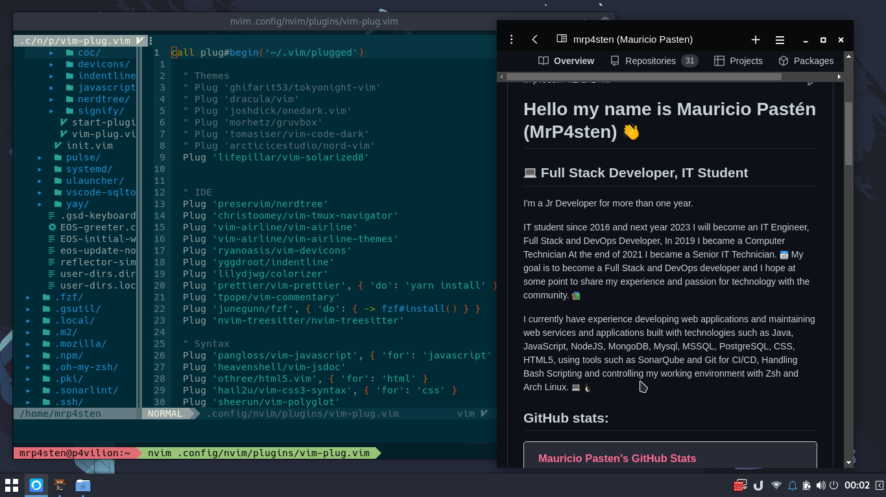

# Welcome to my personal Arch Linux workspace



# Installation/Configuration
<details>
<summary><strong>STEPS</strong></summary>

* <p>First packages</p>

```shell
sudo pacman -S git nano gedit wget
```

Install paru for AUR helper

```shell
sudo pacman -S --needed base-devel
git clone https://aur.archlinux.org/paru.git && cd paru && makepkg -si && cd
```

* <p> Terminal </p>

Install Kitty terminal
```shell
sudo pacman -S kitty
```

Download my favorites Nerd Font
```shell
cd /usr/share/fonts
sudo wget https://github.com/ryanoasis/nerd-fonts/releases/download/v2.1.0/Hack.zip
sudo unzip Hack.zip
sudo rm Hack.zip

sudo wget https://github.com/ryanoasis/nerd-fonts/releases/download/v2.1.0/CascadiaCode.zip
sudo unzip CascadiaCode.zip
sudo rm CascadiaCode.zip
  
sudo wget https://github.com/ryanoasis/nerd-fonts/releases/download/v2.1.0/JetBrainsMono.zip
sudo unzip JetBrainsMono.zip
sudo rm JetBrainsMono.zip
cd
```

Clone my repository
```shell
git clone https://github.com/mrp4sten/dotfiles.git
```

Configuration Kitty
```shell
cp -r dotfiles/config/kitty ~/.config/
```

Installing zsh and plugins
```shell
sudo pacman -S zsh zsh-syntax-highlighting zsh-autosuggestions lsd bat exa mdcat
```
  
Installing oh-my-zsh
```shell
sh -c "$(wget https://raw.github.com/ohmyzsh/ohmyzsh/master/tools/install.sh -O -)"
```

Installing powerlevel10k
```shell
git clone --depth=1 https://github.com/romkatv/powerlevel10k.git ~/powerlevel10k
echo 'source ~/powerlevel10k/powerlevel10k.zsh-theme' >>~/.zshrc
```

Install fzf
```shell
git clone --depth 1 https://github.com/junegunn/fzf.git ~/.fzf
~/.fzf/install
```

Install Neovim
```shell
paru -S neovim
```

Install some dependencies
```shell
paru -S yarn npm nodejs
```

Install vim-plug
```shell
sh -c 'curl -fLo "${XDG_DATA_HOME:-$HOME/.local/share}"/nvim/site/autoload/plug.vim --create-dirs \
       https://raw.githubusercontent.com/junegunn/vim-plug/master/plug.vim'
```

Configuration Nvim
```shell
cp -r dotfiles/config/nvim ~/.config/
```

Copy my personal zsh, bash, nano and vimrc configuration
```shell
cp dotfiles/.zshrc ~/
cp dotfiles/.p10k.zsh ~/
cp dotfiles/.nanorc ~/
cp dotfiles/.bashrc ~/
cp dotfiles/.vimrc ~/
```

* <p> Install my favorite minimal browser </p>
```shell
paru -S min # Note: paru command dont need "sudo"
```

* <p> Install chrome browser </p>
```shell
paru -S google-chrome # Note: paru command dont need "sudo"
```

* <p> Install ulauncher </p>
```shell
paru -S ulauncher # Note: paru command dont need "sudo"
```

* <p> Install vscode </p>
```shell
paru -S visual-studio-code-bin # Note: paru command dont need "sudo"
```

</details>

<details>
<summary><strong>KEYBINDS KITTY</strong></summary>

**Keyboard**

| Keybind                                 | Action                                                    |
|-----------------------------------------|-----------------------------------------------------------|
| <kbd>ctrl + shift + enter</kbd>         | Open tmux                                                 |
| <kbd>ctrl + left</kbd>                  | Move to left in tmux                                      |
| <kbd>ctrl + right</kbd>                 | Move to right in tmux                                     |
| <kbd>ctrl + up</kbd>                    | Move to up in tmux                                        |
| <kbd>ctrl + down</kbd>                  | Move to down in tmux                                      |
| <kbd>ctrl + shift + z</kbd>             | Focus in tmux                                             |
| <kbd>ctrl + shift + t</kbd>             | Open tab                                                  |
| <kbd>ctrl + shift + q</kbd>             | Close tab                                                 |
| <kbd>ctrl + shift + alt + t</kbd>       | Rename tab                                                |
| <kbd>ctrl + shift + left</kbd>          | Move to left tab                                          |
| <kbd>ctrl + shift + right</kbd>         | Move to right tab                                         |

<br>
</details>
